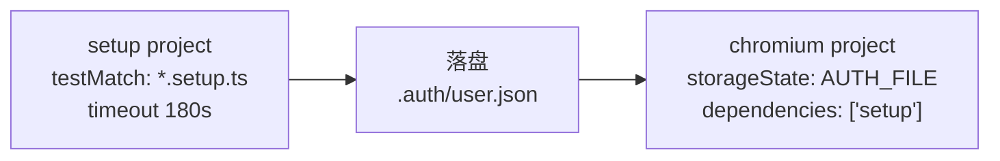

# manaphy

基于 **Playwright + TypeScript** 的端到端（E2E）自动化测试仓库。

示例被测站点是一个 Storybook 应用（`litten-form`），所有业务控件渲染在 `iframe[title="storybook-preview-iframe"]` 内部，因此页面对象统一以 `page.frameLocator(...)` 作为根定位器。

---

## 1. 快速开始

```powershell
# 1. 安装依赖
npm install

# 2. 安装浏览器内核
npx playwright install

# 3. 创建本地环境变量文件
Copy-Item .env.example .env

# 4. 运行全部测试
npm test
```

macOS / Linux 下第 3 步改为：

```bash
cp .env.example .env
```

> `.env`、`.auth/`、`playwright-report/`、`test-results/`、`results.xml` 已在 `.gitignore` 中忽略，不会被提交。

---

## 2. 环境变量（env）

所有环境变量由 [src/utils/env.ts](src/utils/env.ts) 统一加载（内部调用 `dotenv.config()`）。
本地开发复制 `.env.example` 为 `.env` 后填写；CI 环境在 **GitLab CI/CD Variables** 中配置同名变量。

| 变量                 | 是否必填       | 说明                                                                       |
| -------------------- | -------------- | -------------------------------------------------------------------------- |
| `BASE_URL`           | 否（有默认值） | 被测站点根地址。未设置时回退为 `https://liuxian496.github.io/litten-form/` |
| `TEST_USER_EMAIL`    | 当前不需要     | 测试账号邮箱，建议豁免 MFA。仅在接入需要鉴权的应用后必填                   |
| `TEST_USER_PASSWORD` | 当前不需要     | 测试账号密码。仅在接入需要鉴权的应用后必填                                 |

当前被测站点为公开 Storybook，不读取凭据变量，因此三项均可不配置直接运行。

### 2.1 缺失变量的报错

`env.ts` 中的 `required()` 在变量为空时会直接抛错并终止运行。当前 `required()` 只被 `getCredentials()` 调用，而该函数在当前代码路径上没有调用方，**因此下列报错只在接入凭据登录后才会遇到**，此处列出以便接入时有据可查：

```text
缺少环境变量 TEST_USER_EMAIL。本地请复制 .env.example 为 .env 并填写；CI 请在 GitLab CI/CD Variables 中配置。
```

看到此报错时，检查 `.env` 是否存在、变量名是否拼写正确、值是否为空。

### 2.2 导出常量

| 导出               | 值                    | 用途                                         |
| ------------------ | --------------------- | -------------------------------------------- |
| `BASE_URL`         | 见上表                | 注入 `playwright.config.ts` 的 `use.baseURL` |
| `AUTH_FILE`        | `.auth/user.json`     | 登录态（storageState）落盘路径               |
| `getCredentials()` | `{ email, password }` | 读取测试账号，缺失即抛错                     |

---

## 3. 登录机制

### 3.1 三段式结构

当前被测站点是公开的，暂不需要凭据，但登录机制仍按标准三段式保留，以便接入需要鉴权的应用时无需改动 project 结构。

登录只执行一次，结果以 `storageState` 文件复用给所有测试，避免每个用例重复登录：



对应 [playwright.config.ts](playwright.config.ts) 中的两个 project：`setup` 负责登录并落盘，`chromium` 通过 `dependencies` 声明依赖并加载 `storageState`。

### 3.2 当前实现

[tests/auth.setup.ts](tests/auth.setup.ts) —— 当前被测站点为公开 Storybook，无需输入凭据，只需导航并确认首屏就绪后落盘：

```ts
import { test as setup } from '@playwright/test';
import { HomePage } from '../src/pages/home/homePage';
import { AUTH_FILE } from '../src/utils/env';

/**
 * 全局登录初始化，保存会话状态到 storageState 文件中。
 * 需要根据应用的登录逻辑进行调整。
 */
setup('登录', async ({ page }) => {
  const home = new HomePage(page);
  await setup.step('导航到门户首页', async () => {
    await home.goto();
  });

  await setup.step('等待门户首页就绪', async () => {
    await home.waitForSignedIn();
  });

  // 不落盘则 chromium project 的 storageState 指向不存在的文件，所有 spec 直接报错
  await setup.step('保存认证状态到 storageState', async () => {
    await page.context().storageState({ path: AUTH_FILE });
  });
});
```

**两条必须遵守的约束：**

- **必须落盘：** 省略 `page.context().storageState({ path: AUTH_FILE })`，`chromium` project 会因 `.auth/user.json` 不存在而抛 `ENOENT`，所有 spec 全部失败。
- **必须等待就绪后方可落盘：** `HomePage.waitForSignedIn()` 是落盘的**前置同步**而非验收断言；如果页面未就绪就落盘会保存一份无效会话，故障点会被推迟到后续用例，难以定位。

### 3.3 凭据登录示例

当被测试的应用，需要账号密码登录时，可以参考这个示例。其中的 `SignInPage` 需按实际登录页自行在 `src/pages/` 下创建POM：

```ts
import { test as setup } from '@playwright/test';
import { HomePage } from '../src/pages/home/homePage';
import { SignInPage } from '../src/pages/signIn/signInPage';
import { AUTH_FILE, getCredentials } from '../src/utils/env';

setup('登录并保存会话状态', async ({ page }) => {
  const { email, password } = getCredentials();
  const signInPage = new SignInPage(page);
  const home = new HomePage(page);

  await setup.step('打开登录页', async () => {
    await signInPage.goto();
  });

  await setup.step('输入凭据并登录', async () => {
    await signInPage.signIn(email, password);
  });

  await setup.step('等待首页就绪', async () => {
    await home.waitForSignedIn();
  });

  await setup.step('保存认证状态到 storageState', async () => {
    await page.context().storageState({ path: AUTH_FILE });
  });
});
```

改造要点：

- 凭据一律通过 `getCredentials()` 从环境变量读取，**禁止硬编码到代码或提交到仓库**。
- 登录页的元素定位全部封装在 `SignInPage` 内，setup 文件本身不出现任何 locator。
- `signIn()` 只做填写与提交，**不要**在内部断言刚填进去的值（重言式），登录完成的判定交给 `home.waitForSignedIn()`。
- 填密码会把明文留在 Playwright trace 里：CI 上的 trace artifact 必须设为非公开，或直接把 `use.trace` 设为 `off`。

---

## 4. 常用命令

| 命令                  | 说明                                    |
| --------------------- | --------------------------------------- |
| `npm test`            | 运行全部测试                            |
| `npm run test:ui`     | 以 Playwright UI 模式运行，便于逐步调试 |
| `npm run test:headed` | 显示浏览器窗口运行                      |
| `npm run test:debug`  | 开启 Inspector 断点调试                 |
| `npm run codegen`     | 启动录制器，生成操作脚本草稿            |
| `npm run report`      | 打开 HTML 测试报告                      |
| `npm run typecheck`   | 仅做 TypeScript 类型检查                |

运行单个文件或按标题过滤：

```powershell
npx playwright test tests/smoke/littenForm.smoke.spec.ts
npx playwright test -g "初始值"
```

---

## 5. 目录结构

```text
.github/
  instructions/   # 自动生效的编码约束（applyTo: tests/**）
  skills/         # Copilot 技能：创建与审查 POM / spec
src/
  pages/          # 页面对象（POM），所有元素定位的唯一归属地
    components/   # 跨域复用的组件对象
    home/         # 门户首页
    littenForm/   # 被测 Storybook 的各 story
  utils/
    env.ts        # 环境变量与 AUTH_FILE / BASE_URL
    timeouts.ts   # 超时常量的唯一来源
tests/
  auth.setup.ts   # 全局登录初始化
  smoke/          # 冒烟测试
playwright.config.ts
```

`src/pages/` 按**功能域**分子目录，域下再放页面对象，不平铺：门户首页是 `home/homePage.ts`；被测 Storybook 的各 story 归在 `littenForm/` 下（如 `littenForm/initialValueStoryPage.ts`），因为它们共享同一个 preview iframe 根定位器。跨域复用的组件对象放 `src/pages/components/`。

---

## 6. 使用 Copilot Skill 创建测试

本仓库在 `.github/skills/` 下内置了 4 个 **VS Code Copilot Skill**。在 Copilot Chat 的 **Agent 模式**下，描述你的意图即可自动匹配对应技能；也可以直接点名调用，例如「用 create-spec 帮我写这个 spec」。

同时，`.github/instructions/playwright-tests.instructions.md` 会对 `tests/**` 下的文件**自动生效**，无需手动引用。

### 6.1 技能一览

| 技能          | 何时使用                                                                                                                      |
| ------------- | ----------------------------------------------------------------------------------------------------------------------------- |
| `create-spec` | 把 codegen 录制结果转成测试、新增 test、决定 test 粒度与 describe 分组、写冒烟测试。如果需要创建POM，级联调用create-pom skill |
| `create-pom`  | 为新页面创建页面对象、给已有 POM 新增方法、抽取复合控件为组件对象、纠结 locator 该 public 还是 private                        |
| `review-pom`  | 审查已有页面对象是否合规（命名、等待逻辑、硬编码超时、断言归属）                                                              |
| `review-spec` | 审查测试文件的分组结构、test 数量上限、分步注释、边界（`test.only` 残留等）                                                   |

### 6.2 推荐工作流

1. **规划验收点**：想清楚本次要覆盖哪些可观察的验收结论（如「默认值正确展示」「勾选 Fruit 后状态更新」），确保接下来的录制里包含这些场景。它们对应 `create-spec` 的可选输入「用例描述：步骤 + 期望结果」；不提供也行——它会从录制产物推断并列出来等你确认，但你自己列会更准。
2. **录制**：`npm run codegen`，在浏览器中走一遍业务流程，得到原始操作脚本。
3. **写用例**：把录制产物**整段**贴给 Copilot，请求「基于这段录制写冒烟测试」→ 触发 `create-spec`。它会按验收条件切分 test，并在「抽 POM」阶段按流程转到 `create-pom`。两者共同产出 `src/pages/` 下的页面对象与 `tests/` 下的 spec；若环境未自动转，按提示点名 `create-pom` 即可。

4. **审查**：**先 review POM、再 review spec**——POM 形态稳定后再看 spec 的引用，可避免在 spec review 中发现 POM 缺方法而回头返工。分别请求「review 这个 POM」「review 这个 spec」→ 触发 `review-pom` / `review-spec`，按输出的判据表逐条修正。
5. **验证**：`npm run typecheck` + `npm test`；失败时按「故障排查」一节定位。

> 录制产物是 `create-spec` 的必需输入，务必原样提供，不要只给截图或口头描述，否则它会停下来向你索要。
> 单独调用 `create-pom` 的场景是「给已有 POM 新增方法」或「抽取组件对象」，不在从零建用例的主流程中。

### 6.3 提问示例

按使用场景分三类，每类给出可直接复制的提问形态。前两类可以省略 skill 名（Agent 模式按语义自动匹配），也可以直接点名；第三类的宾语通常已能区分（`.spec.ts` 走 `review-spec`，`src/pages/` 下的走 `review-pom`），但当你同时贴了 POM 和 spec、或一次要审多个同类文件想指定先看哪一个时，点名更稳妥。

**写测试 —— 触发 `create-spec`**

```text
用 create-spec 把这段 codegen 录制写成冒烟测试，覆盖两个验收点：
默认值正确展示、勾选 Fruit 后状态更新：
<把录制产物整段粘贴在这里>
```

也可以省略 skill 名，直接说「基于这段录制写冒烟测试」——语义匹配同样会落到 `create-spec`。

**给已有 POM 加方法 —— 触发 `create-pom`**

```text
给 src/pages/littenForm/initialValueStoryPage.ts 的 InitialValueStoryPage
加一个 readFruitCheckboxState() 方法，用于在 spec 里断言 Fruit 复选框的勾选状态。
```

带上文件路径与用途，`create-pom` 能直接定位并判断新方法该是 public 还是 private；只写类名它会反查一遍。

**审查 —— 触发 `review-pom` / `review-spec`**

```text
review 一下 src/pages/littenForm/initialValueStoryPage.ts 是否合规
review 一下 tests/smoke/littenForm.smoke.spec.ts 是否合规
```

不写具体审查范围时，`review-pom` / `review-spec` 会按各自的全部判据逐条过一遍。只在确有需要时收窄，例如「只看 spec 的分组是否合规」——默认全审比只看一类更不容易漏。

---

## 7. 编写约定速览

以下为最常触发的硬性约束，完整规则见 `.github/instructions/` 与 `.github/skills/`。

- **元素访问边界**：spec 文件中禁止出现 `page.locator` / `getByRole` / `getByTestId`，所有元素访问必须经由 `src/pages/` 下的 POM。
- **超时常量**：全局预算在 [playwright.config.ts](playwright.config.ts) 统一设定（`use.actionTimeout`、`use.navigationTimeout`、`expect.timeout`），具体数值以该文件为准。**禁止在代码中写超时字面量**；确需偏离全局预算时，在 [src/utils/timeouts.ts](src/utils/timeouts.ts) 新增具名常量并在注释中写明为何必须偏离——该文件是偏离值的唯一来源（`tests/timeouts.ts` 仅作转发，勿新增）。
- **分组与数量**：一个 spec 文件顶层 `describe` 恰好 1 个，子 `describe` 0~3 个（每个含 2~8 个逻辑 test），文件内逻辑 test 总数 ≤ 16。
- **分组前提**：只有当组内 test 的差异维度一致时才成组；创建 / 删除 / 编辑这类并列流程不应硬凑进同一分组。
- **test 命名**：写验收结论而非操作步骤；每个 test 至少有一条断言（POM 的 `expectX()` 也算）；步骤用 `test.step` 分段。
- **冒烟测试**位于 `tests/smoke/`，文件名以 `.spec.ts` 结尾。

---

## 8. 在 VS Code 中调试测试

### 8.1 安装扩展

官方扩展 **Playwright Test for VS Code**（标识符 `ms-playwright.playwright`）。在扩展市场搜索安装，或执行：

```powershell
code --install-extension ms-playwright.playwright
```

扩展运行的前提是项目已执行过第 1 节的 `npm install`（提供 `@playwright/test`）与 `npx playwright install`（提供浏览器内核），否则面板里的用例跑不起来。

### 8.2 测试资源管理器

打开侧边栏的 **Testing**（烧瓶图标）面板，`tests/` 下的用例会按文件 / describe / test 层级展开：

| 操作          | 入口                                                           |
| ------------- | -------------------------------------------------------------- |
| 运行单个 test | 源码中 `test(...)` 行号旁的绿色三角，或面板中该节点的▷         |
| 调试单个 test | 右键该 test → **Debug Test**，配合 TypeScript 源码断点直接单步 |
| 运行整个文件  | 面板中文件节点的 ▷                                             |
| 查看失败详情  | 点击面板中的红色用例，错误信息会内联到出错行                   |

### 8.3 工具栏操作

Testing 面板底部的 **PLAYWRIGHT** 区域提供以下操作：

| 操作                | 作用                                                                                             |
| ------------------- | ------------------------------------------------------------------------------------------------ |
| `Show browser`      | 以 headed 模式运行并保留浏览器窗口，便于观察执行过程；配合 `Pick locator` 可直接在该窗口拾取元素 |
| `Pick locator`      | 在浏览器中点选元素，实时生成推荐的定位器表达式                                                   |
| `Record new`        | 新建文件并录制，等价于 `npm run codegen`                                                         |
| `Record at cursor`  | 在光标处追加录制，用于给现有用例补步骤                                                           |
| `Show trace viewer` | 运行后自动打开 Trace Viewer                                                                      |

### 8.4 本仓库的特殊之处

- **会自动先跑一次登录。** `chromium` project 声明了 `dependencies: ['setup']`，在扩展里运行任何一个 test，都会先执行 [tests/auth.setup.ts](tests/auth.setup.ts) 的「登录」。面板中多出一条记录是预期行为，不是误触发。
- **`Pick locator` 的产物不能直接贴进 spec。** 第 7 节的元素访问边界禁止 spec 出现 `page.locator` 等调用，拾取结果必须搬进 `src/pages/` 下的 POM 再由 spec 调用。
- **拾取结果会带 `frameLocator` 前缀。** 被测控件渲染在 `storybook-preview-iframe` 内。搬进 POM 时以页面对象已有的 frameLocator 根定位器为准，只取后半段链路，不要重复嵌套。
- **断点停留过久会触发超时。** 需要长时间单步时改用 `npm run test:debug`（即 `playwright test --debug`），它会开启 PWDEBUG 模式并禁用默认超时，比在扩展里硬扛更可靠。

---

## 9. 报告与产物

| 产物                | 位置                 | 说明                                     |
| ------------------- | -------------------- | ---------------------------------------- |
| HTML 报告           | `playwright-report/` | `npm run report` 打开                    |
| JUnit 报告          | `results.xml`        | 供 CI 解析测试结果                       |
| Trace / 截图 / 录屏 | `test-results/`      | 均为 `retain-on-failure`，仅失败用例保留 |

排查失败用例时，优先打开 HTML 报告中的 Trace Viewer，可逐帧回放 DOM 快照、网络请求与控制台输出。

---

## 10. 故障排查

| 现象                                                           | 成因与处理                                                                                                                                                                                                                                                     |
| -------------------------------------------------------------- | -------------------------------------------------------------------------------------------------------------------------------------------------------------------------------------------------------------------------------------------------------------- |
| `ENOENT: no such file or directory ... .auth/user.json`        | `setup` project 没跑过或中途失败，`chromium` project 找不到 storageState。执行 `npx playwright test --project=setup` 单独跑一次生成即可                                                                                                                        |
| `缺少环境变量 XXX`（当前配置不会遇到，接入凭据登录后可能出现） | 见 2.1。检查 `.env` 是否存在、变量名拼写、值是否为空                                                                                                                                                                                                           |
| `test-results/` 体积快速增长                                   | 失败用例的 trace / 录屏累积所致。该目录已被 `.gitignore` 忽略，直接删除整个目录即可，下次运行会重建                                                                                                                                                            |
| 用例超时（`Timeout ... exceeded`）                             | 先开 Trace Viewer 看卡在哪一步。**不要**加超时字面量，按第 7 节的超时约定处理；若是等待条件写错，应修 POM 的 `waitForX()` 而非放大超时                                                                                                                         |
| CI 绿灯但本地失败（或反之）                                    | 多半是并发差异：CI `workers` 固定为 1，本地并行度更高（Playwright 默认 `workers` 为 CPU 核数的一半）。用 `npx playwright test --workers=1` 复现：若本地也失败，说明与并行相关（test 间的顺序依赖，或并发写入同一份数据），再结合 Trace Viewer 定位具体的交错点 |

---

## 11. CI 说明

- `forbidOnly`：CI 环境下存在 `test.only` 会直接失败，提交前务必清理。
- `retries`：CI 重试 2 次，本地不重试。
- `workers`：CI 固定为 1，避免资源竞争导致的不稳定。
- CI 需注入的变量：`BASE_URL`。接入真实登录后另需 `TEST_USER_EMAIL` / `TEST_USER_PASSWORD`（当前被测站点为公开 Storybook，无需这两项）。

---

## 维护信息

| 项       | 值                                                   |
| -------- | ---------------------------------------------------- |
| 适配版本 | 见 [package.json](package.json) 的 `devDependencies` |
| 维护者   | 弗特马克贝因                                         |
| 最近更新 | 2026-09-22                                           |
| 许可     | Apache-2.0（见 [LICENSE](LICENSE)）                  |
